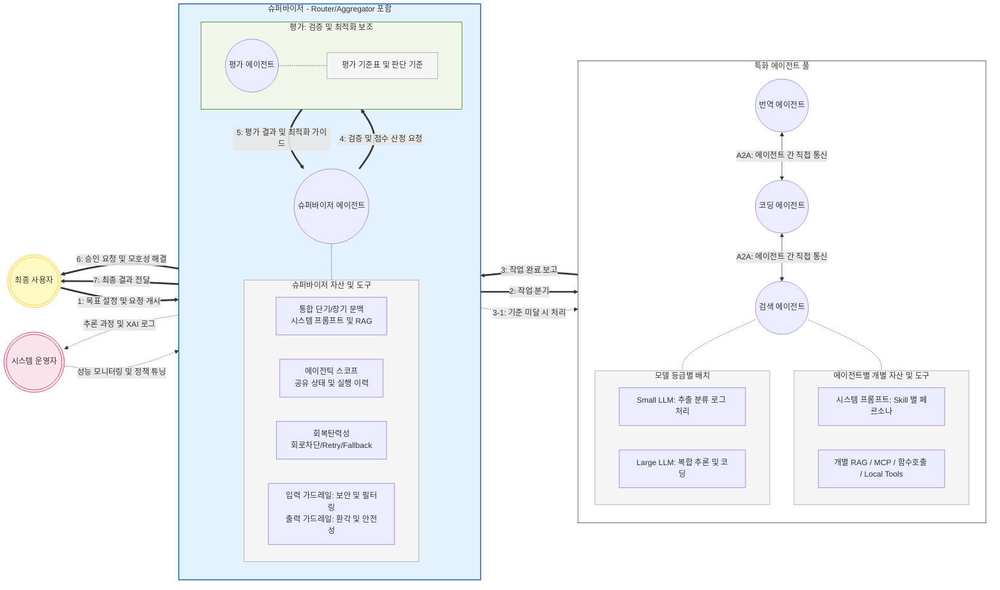
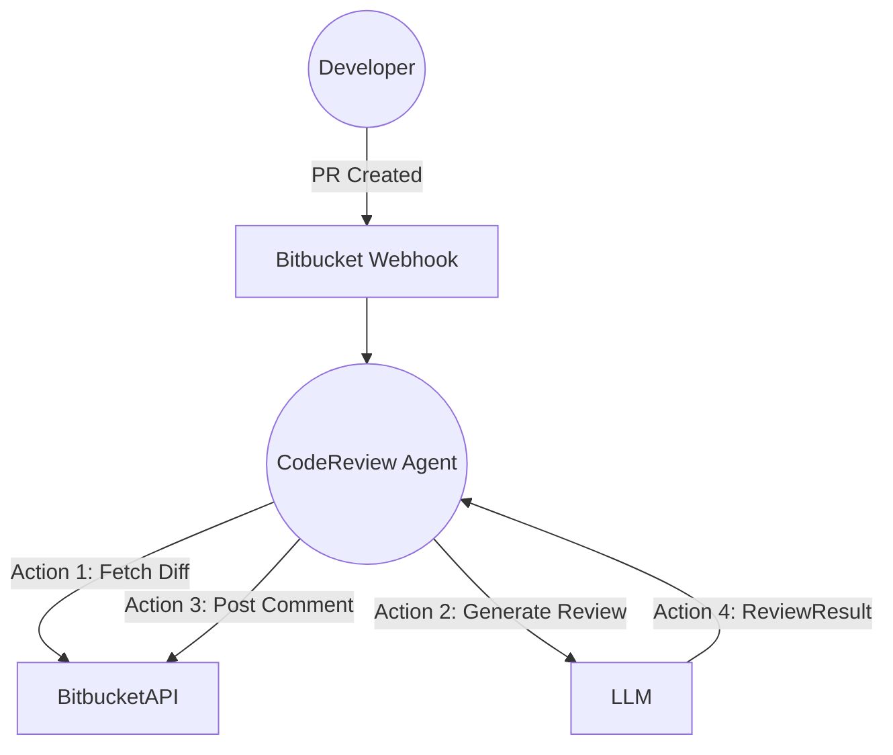
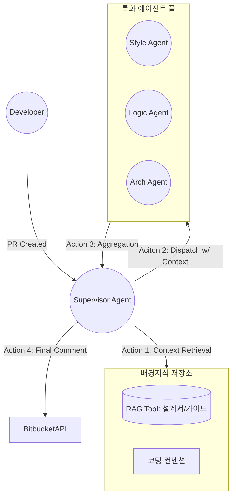
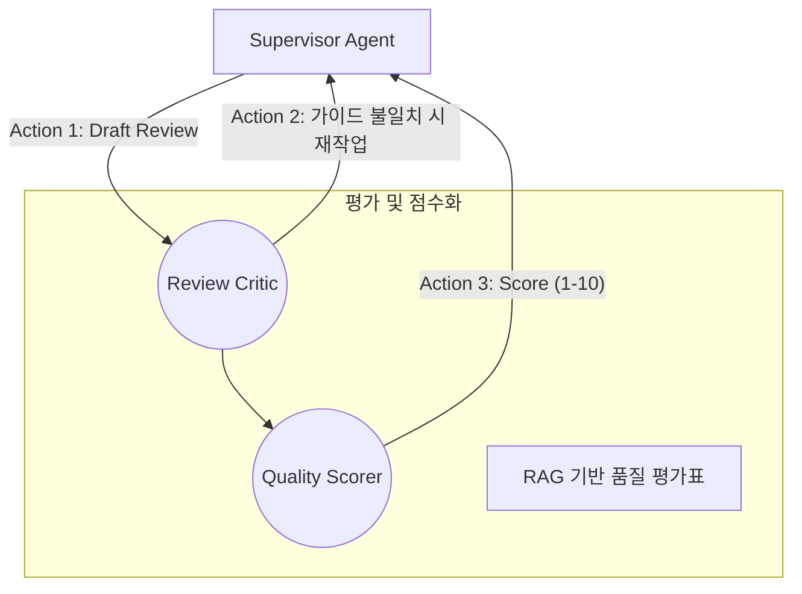
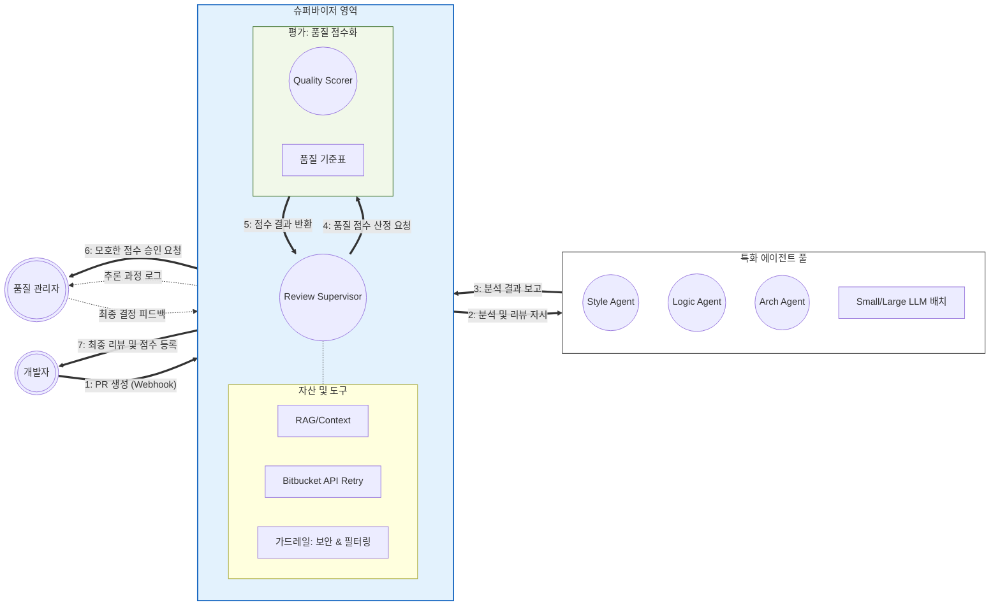

<!-- slide template="[[tpl-con-title]]" -->

## CAM연구소 AI 기술 확보 계획
::: block
#### PR Review Agent 개발 기획 / 2026-02-12
:::

note: ==에이전틱 워크플로우 개발 역량 확보를 위한 기술적 기틀을 마련하는 것이 핵심임.==

---
<!-- slide template="[[tpl-con-default-box]]" -->

::: title
### _**목표**_
:::

::: block
- Agentic AI 주요 디자인 패턴 이해
- Java 생태계 기반 AI 도구 분석
- Embabel 프레임워크 개요
- Bitbucket PR Review Agent PoC 기획
:::<!-- element style="font-size:18px;font-weight:600;line-height:1.7" pad="20px 0" -->

note: ==단순한 텍스트 생성을 넘어, 스스로 도구를 사용하고 계획을 수립하는 '에이전틱 워크플로우' 개발 역량을 확보하는 것이 목표임.==

---
  
<!-- slide template="[[tpl-con-default-slide]]" -->

::: title
### **Agentic AI 기술 확보의 필요성**
:::

- **LLM을 우리 프로세스에 최적화**: 
	- 단일 추론의 한계를 넘어, 여러 에이전트가 협업하고 검증하는 Agentic AI를 통해 실제 업무에 투입 가능한 수준의 결정론적 결과물 도출 가능
- **기업 생산성 개선**: 
	- 코드 리뷰와 같은 고부하 지식 노동의 자동화를 통해 개발 주기를 단축하고, 품질 관리의 표준을 상향 평준화
	- 유사 프로세스를 최적화 할 수 있는 기술 확보
- **AI 기술 확보**: 
	- GOAP, Multi-Agent 오케스트레이션 등 최신 AI 아키텍처 숙련을 통한 연구소 기술 역량 구축
- **자율적 문제 해결 역량**: 
	- 정해진 경로만 따르는 기존 자동화와 달리, 목표(Goal)를 이해하고 스스로 도구(API, DB)를 선택하여 사용하는 차세대 AI 어플리케이션 패러다임 경험

---

<!-- slide template="[[tpl-con-default-slide]]" -->

::: title
### **프로젝트 규모 및 일정**
:::

#### 1 Man-month 이내의 집중적인 PoC 수행으로 핵심 기술 내재화

- **기간**: **총 4주 (1개월)**
	- 1주차: Phase 1 (기본 인프라 및 Bitbucket 연동)
	- 2주차: Phase 2 (RAG 지식 베이스 구축 및 워커 풀 구성)
	- 3주차: Phase 3 (평가 에이전트 및 품질 점수화 로직 구현)
	- 4주차: Phase 4 (가드레일 적용 및 인간 개입(HITL) 프로세스 완성)
- **범위**: Bitbucket PR 자동 리뷰 및 품질 점수화 시스템 구축
	- PR Diff 분석, 컨벤션/로직/아키텍처 전문 리뷰, 1~10점 척도 품질 점수 산출
- **비용**: **1 Man-month**
	- 연구소 내부 인력 1인 전담 및 온라인 AI 인프라(LLM API 등) 활용

---

<!-- slide template="[[tpl-con-default-slide]]" -->

::: title
### **요구사항 개요**
:::

- **지능적인 코드 분석과 정량적 품질 평가를 제공하는 AI 리뷰어**
	- 개발자가 Bitbucket에 PR을 생성하면, AI 에이전트 군단이 프로젝트 표준과 설계 의도를 바탕으로 코드를 검토하고 상세 피드백과 품질 점수를 자동으로 등록하는 시스템
- **핵심 요구사항**:
	- Bitbucket Webhook 기반 PR 생성/업데이트 실시간 감지
	- RAG를 통한 프로젝트별 코딩 표준 및 설계 문서 동적 참조
	- Style, Logic, Arch 관점의 전문 에이전트별 독립 분석 및 결과 취합
	- 분석 결과를 정량화하여 1~10점 사이의 품질 점수 산출
	- 점수 임계치 미달 시 관리자 승인 대기(HITL) 및 알림 전송

---

<!-- slide template="[[tpl-con-splash]]" -->

# **주요 디자인 패턴**

---

<!-- slide template="[[tpl-con-default-slide]]" -->

::: title
### **기반 패턴 <small>에이전트의 기본적인 인지 및 행동 능력 정의</small>**
:::

- **인지 및 행동 능력:**
	- **기본 추론**: 단일 LLM 호출을 통한 의사결정 (Prompt Engineering)
	- **도구 사용**: 외부 API, DB 조회 등 액션 수행
	- **메모리 관리**: 단기 맥락(Window) 및 장기 지식(RAG) 유지
- **표준 규약 및 연결:**
	- **MCP (Model Context Protocol)**: 표준화된 규약을 통한 원격 도구 및 리소스의 동적 연결
- **안전 및 신뢰성**:
	- **가드레일**: 입출력 검증을 통한 환각 및 프롬프트 주입 방지 (Success, Fatal, Retry, Reprompt)
	- **회복탄력성**: 네트워크 및 모델 오류에 대응하는 Retry, Timeout, Circuit Breaker, Fallback 메커니즘

---

<!-- slide template="[[tpl-con-default-slide]]" -->

::: title
### **워크플로우 패턴 <small>제어 흐름을 직접 정의하며, 에이전틱 요소를 결합한 결정론적 패턴</small>**
:::

- **순차적 체이닝:** 이전 단계의 출력을 다음 단계의 입력으로 사용하는 직렬 파이프라인
- **라우팅:** 라우터 에이전트가 의도를 파악하여 적절한 전문 에이전트나 도구로 요청을 분기
- **병렬화:** 독립적인 하위 작업들을 여러 LLM/에이전트에 동시 할당하고, 결과를 다시 하나로 취합(Aggregator 사용)
- **반복 (Looping):** 특정 조건(Exit Condition)이 만족될 때까지 작업을 반복 실행
- **선언적 워크플로우:** 인터페이스와 어노테이션을 통해 복잡한 흐름을 선언적으로 정의

---

<!-- slide template="[[tpl-con-default-slide]]" -->

::: title
### **자율적 오케스트레이션 패턴 <small>목표가 주어지면 에이전트가 스스로 계획을 수립하고 실행 경로를 결정하는 패턴</small>**
:::

- **평가-최적화 루프 (Evaluator-Optimizer):** 
	- 생성 에이전트와 검증 에이전트가 루프를 형성하여, 기준을 충족할 때까지 결과를 반복 수정
- **슈퍼바이저 (Supervisor / Orchestrator):** 
	- 중앙 에이전트가 복잡한 요청을 분석하고, 하위 에이전트들에게 작업을 할당 및 관리하며 전체 진행 상황을 총괄
- **에이전틱 스코프 (Agentic Scope):** 
	- 여러 에이전트가 참여하는 시스템에서 상태와 변수를 공유하고 실행 이력을 기록하여 협업의 맥락을 유지
- **A2A (Agent-to-Agent):** 
	- 에이전트 간의 통신 규약을 정의하여, 블랙박스 형태의 서로 다른 에이전트 시스템들이 협업하고 작업을 위임
- **인간 개입 (Human-in-the-loop):** 
	- 중요 의사결정 단계에서 인간의 승인이나 피드백을 받는 인터페이스 설계

---

<!-- slide template="[[tpl-con-3-2]]" -->

::: title
### **AI 에이전트 응용 패턴**
:::

::: left
#### **성능 및 설명가능성**
- **Agent-as-a-Judge**: 상위 에이전트가 하위 에이전트의 동작 적절성을 정량적/정성적으로 평가
- **XAI (Explainable AI)**: 인간 사용자가 동작 이유를 알 수 있도록 추론 과정 로그 시각화

#### **비용 관리 (FinOps)**
- **모델 믹싱**: 루틴한 작업은 소규모 모델(1~30B)로, 복합 추론은 대형 모델로 분산하여 비용 최적화
:::

::: right
#### **특화 기능 에이전트**
- **코딩 에이전트**: IDE/CLI 연동을 통한 코드 생성, 버그 수정 및 테스트 자동화
- **컴퓨터 사용 에이전트**: 시각 언어 모델(VLM)을 결합하여 브라우저, 터미널 등 UI 직접 제어
- **시뮬레이션**: 통제된 가상 환경에서 전략 학습 및 배포 전 위험 최소화
:::

---

<!-- slide template="[[tpl-con-splash]]" -->

# **SW 동작 주기**
::: block
#### **Agentic AI Lifecycle**
:::

---

<!-- slide template="[[tpl-con-default-slide]]" -->

::: title
### **자율 에이전트 동작 아키텍처**
:::

::: block

:::<!-- element class="mermaid-scale-center" style="width:100%;height:100%;" -->

---

<!-- slide template="[[tpl-con-splash]]" -->

# **Java 기반 개발 도구**
::: block
#### **Java AI Ecosystem**
:::

---

<!-- slide template="[[tpl-con-default-slide]]" -->

::: title
### **도구별 역할 및 상호 관계**
:::

| 도구              | 비고                                          |
| :-------------- | :------------------------------------------ |
| **LangChain4j** | Java용 LLM 통합 표준. 모델 연동, RAG 등 모든 인프라의 기저    |
| **Quarkus**     | 클라우드 네이티브 Java 프레임워크. LangChain4j 선언적 사용 지원 |
| **Spring AI**   | Spring Boot 기반 AI 추상화. 엔터프라이즈 통합에 유리        |
| **LangGraph4j** | 그래프 기반 워크플로우 제어. 복잡한 Multi-Agent 협업 시 활용    |
| **Embabel**     | GOAP(목표 지향 계획) 기반의 자율 에이전트 프레임워크            |

---

<!-- slide template="[[tpl-con-default-slide]]" -->

::: title
### **Embabel: GOAP 기반 자율성**
:::

- **핵심 메커니즘: GOAP**
	- **동적 계획 수립**: 고정된 경로 대신, 목표 달성을 위한 최적의 Action을 실시간 계산
	- **재계획**: 상황 변화 시 즉시 경로 수정
	- **설명 가능성**: 결정 근거 추적 가능
- **OODA 루프**
	- **Observe** (관찰) → **Orient** (분석) → **Decide** (결정) → **Act** (실행) 무한 반복
- **강타입**
	- **Java Record 활용**: LLM의 비정형 출력을 구조화된 객체로 자동 변환
	- **컴파일 타임 체크**: 런타임 에러 최소화 및 IDE 지원 극대화
- **블랙보드 시스템**
	- 중앙 저장소를 통한 도메인 객체 공유 및 파라미터 자동 바인딩

::: source
- https://docs.embabel.com/
:::

note: ==Spring 창시자 Rod Johnson이 주도하는 프로젝트로, JVM 생태계에 최적화된 에이전트 프레임워크임.==

---

<!-- slide template="[[tpl-con-default-slide]]" -->

::: title
### **Embabel vs 기존 프레임워크**
:::

| 기능 | **Embabel (GOAP)** | **LangGraph 등 (FSM)** |
| :--- | :--- | :--- |
| **워크플로우 제어** | **동적 허용**: 목표에 맞춰 경로 자동 생성 | **결정론적**: 미리 정의된 상태 전이 |
| **유연성** | 환경 변화에 따른 실시간 재계획 | 고정된 그래프 경로 이탈 시 대응 난해 |
| **타입 안정성** | **강타입**: Java Record 기반 데이터 흐름 | 문자열 및 프롬프트 의존성 높음 |
| **확장성** | Action 추가 시 기존 로직 수정 불필요 | FSM 정의 및 흐름 로직 수정 필요 |

---

<!-- slide template="[[tpl-con-splash]]" -->

# **PoC 구축 계획**
::: block
#### **Bitbucket PR Review Agent**
:::

---

<!-- slide template="[[tpl-con-2-1-box]]" -->

::: title
### **Phase 1: 기초 구성**
:::

::: right
**목표**: 
- PR Webhook 연동 및 단일 에이전트 리뷰 파이프라인 구축
**내용**: 
- **Bitbucket API 연동:** Webhook 수신 및 Diff 추출 기능
- **Single Pass Review:** 단일 프롬프트를 이용한 기초 문법 및 오타 검사
- **Embabel 적용:** `@Agent`와 `@Action`을 사용하여 API 호출 및 리뷰 생성을 구조화
:::

::: left
::: block

:::<!-- element class="mermaid-scale-center" style="width:100%;height:100%;" -->
:::

---

<!-- slide template="[[tpl-con-2-1-box]]" -->

::: title
### **Phase 2: 지식 기반 워커 풀**
:::

::: right
**목표**: 
- RAG를 통한 배경지식 참조 및 특화 워커(Worker) 분산 배치
**내용**: 
- **Dynamic Context (RAG):** `EmbeddingService`를 통해 프로젝트 설계 문서, API 명세서 등을 검색하여 리뷰에 반영
- **Static Context:** `PromptContributor`를 이용해 프로젝트 핵심 표준(Standard) 주입
- **Worker Pool:** Style(Small LLM), Logic(Large LLM), Arch(Large LLM) 워커 병렬 실행
:::

::: left
::: block

:::<!-- element class="mermaid-scale-center" style="width:80%;height:80%;" -->
:::

---

<!-- slide template="[[tpl-con-2-1-box]]" -->

::: title
### **Phase 3: 품질 검증 및 점수화**
:::

::: right
**목표**: 
- 리뷰 타당성 검증 및 코드 품질 점수(1~10점) 정량화
**내용**: 
- **Agent-as-a-Judge:** 평가 에이전트가 워커의 리뷰를 RAG 가이드라인과 비교 검증
- **Quality Scorer:** 리뷰 결과를 바탕으로 품질 점수 및 근거 데이터 생성
- **Embabel 특수 기능 적용:** `EvaluatorOptimizer` DSL을 사용한 품질 미달 시 재리뷰 루프 구현
:::

::: left
::: block

:::<!-- element class="mermaid-scale-center" style="width:100%;height:100%;" -->
:::

---

<!-- slide template="[[tpl-con-default-slide]]" -->

::: title
### **Phase 4: 완전 자율 및 인간 개입(HITL)**
:::

::: block

:::<!-- element class="mermaid-scale-center" style="width:100%;height:100%;" -->

- 인간 개입(HITL) 및 가드레일이 포함된 완전한 자율 오케스트레이션 완성:
	- **Human-in-the-loop:** 점수 임계치 경계(예: 4~6점)에 있는 PR은 관리자에게 최종 승인 요청
	- **Guardrails:** 보안 키 유출 탐지 및 환각 방지 등 입출력 검증 강화
	- **XAI & Observability:** 리뷰 의사결정 과정을 로그로 남겨 운영자가 모니터링 및 정책 튜닝

---

<!-- slide template="[[tpl-con-splash]]" -->

# **감사합니다**